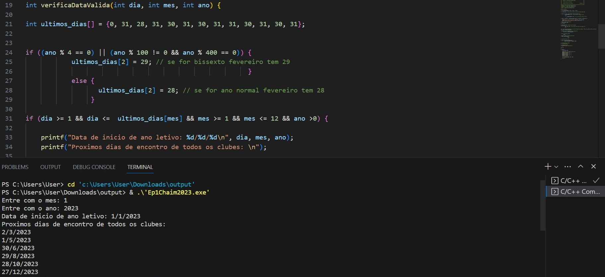
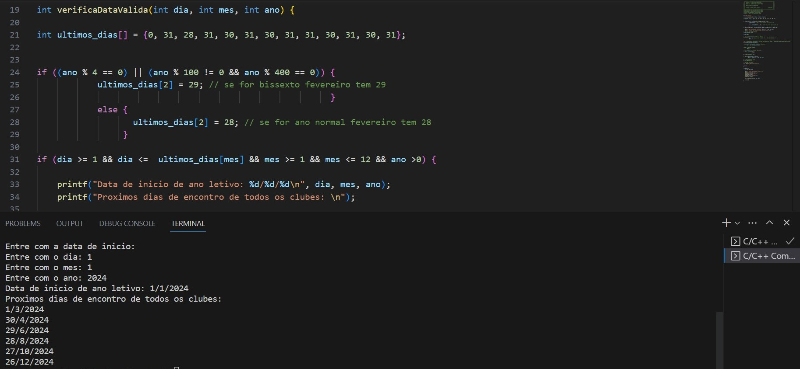

# Primeiro-Programa-em-C
Estou no primeiro ano da faculdade de Sistemas de Informação na USP e esse foi meu primeiro trabalho e contato com programação para disciplina de Introdução a Programação.
A descrição do que deveria ser feito no trabalho está nesse arquivo EP1_ach2001_2023.pdf e as saídas são 112023 e 112024

